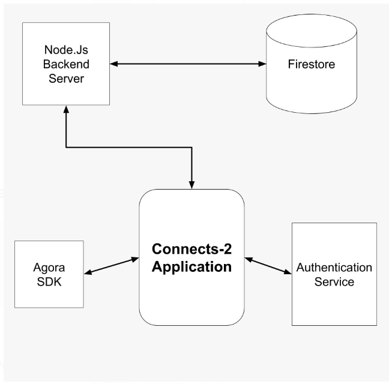

# CONNECTS-2

 

## Introduction

Our team has been heavily inspired by the trend <b>"Atma Nirbhar"</b> which means “self-sufficient”. That’s the reason why we came up with a start-up plan or in other words a community that will connect the enthusiastic school students to the college students with interest in certain domains (be it from basic coding to advanced concepts of IoT, ML, and AI). As a result, it will not only help the one learning but also the one teaching. It will give a cutting edge to the school students over the others. Not only this, the college students, who are in their final years and struggling hard to get placed, this will be a sigh of relief for them as they have a source of income.

 

## Platform Architecture

Technologies used:
1. Flutter
2. Nodejs
3. Expressjs
4. Google OAuth
5. Firestore
6. Cloud build
7. Google App Engine
8. Obviously, GitHub

 

## Servers Online
|Server   |Base Link   |
|---|---|
| Google App Engine Service | https://connects2.uc.r.appspot.com    |

 

## Postman

 

## Having Issues
This project uses [GitHub Issues](https://github.com/ShirshaDatta/Connects-2/issues) for tracking bugs and feature requests, so feel free to open one if you find any :)

 

##### Made with ❤️ by  Team Connects-2

